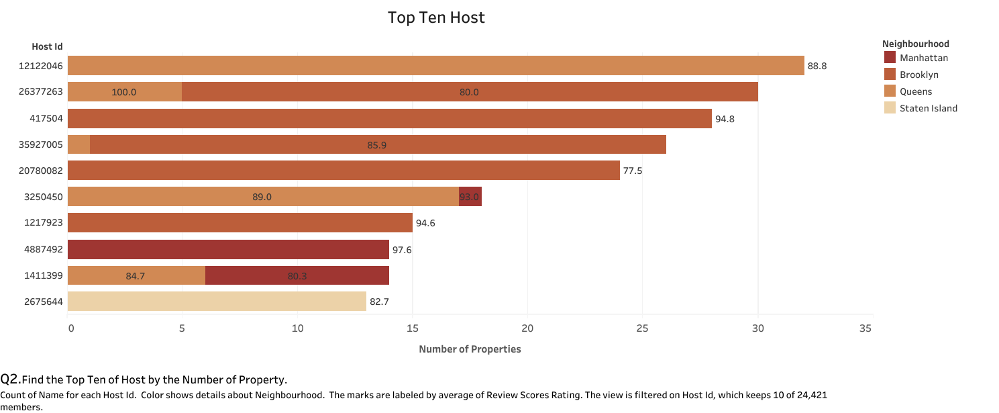

v# Final-Project-Tableau

## Project/Goals

The data used in this project is Airbnb listings in New York City. This data was compiled from Inside Airbnb. The dataset is available here as [airbnb.xlsx](https://docs.google.com/spreadsheets/d/1BJWyZpZrrRUla_EQ6Pnusy0KH31UMGf2/edit?usp=sharing&ouid=108445376648788204707&rtpof=true&sd=true).

The goals of this project are:

1- Identifying trends and patterns in Airbnb rental data, such as price, popular destinations, and types of properties through visualization

2- Forecasting future price for Airbnb listings

3- Gain insights into the Airbnb rental market

## Process
### Step 1- Importing data from Excel file to Tableau
### Step 2- Checking the data types recognized by Tableau
### Step 3- Performing lots of visualization 
### Step 4- Selecting proper plots to answer our questions
### Step 5- Forecasting and clustering
### Step 6-  Generating dashboard

## Results
The Tableau project have been performed for Option 2. The data used in this project is Airbnb listings in New York City. The data set has 13 fields and 30,478 records.

The results are presented as follows:

### Questions:
#### Q1- Price Histogram
Based of this plot, price distribution is not normal and skewed to the right.

#### Q2- Determine top ten hosts by number of their properties

#### Q3- What is the number of listing in each neighborhood and related review scoring?

#### Q4- Investigate the average price in each neighborhood based on the property type.

#### Q5- In which areas, price averages have increasing trend?

Other performed visualizations and results are presented here:

#### 1- Average Price for Room Types of Different Neighborhood
As we see, the major number of listings in all neghbourhoods is 'Entire Home/Apt' category.

#### 2- Clustering

#### 3- Outlier Detection
By selecting each bar from the 'Explain data' menu, we can observe outlier and extreme values. For example, in Manhattan, a $10,000 listing is an outlier record.

#### 4- Forecasting
Price forercasting shows that price will increase by 6.7% and 9.0% in Bronx and Staten Island respectively. In other areas price will have no significant change.   

#### 5- Dashboard
Because dashboards are provided to present dynamic reports, it's better to assess 
[AirBnB_NYC_Dashboard.twbx](Tableau/AirBnB_NYC_Dashboard.twbx).

## Challenges 
1- There are null values in data set which excluded in visualization.

2- Tableau is not proper tool for data cleaning and outlier detecting.

3- Tableau Public options are limited.

4- Tableau Public can not connect to Python IDEs.

## Future Goals
By getting more data and analyzing historical data, and market trends, the project can aim to create predictive models to forecast future demand for Airbnb rentals, helping hosts make informed decisions about pricing and marketing, and maximize their rental income.

